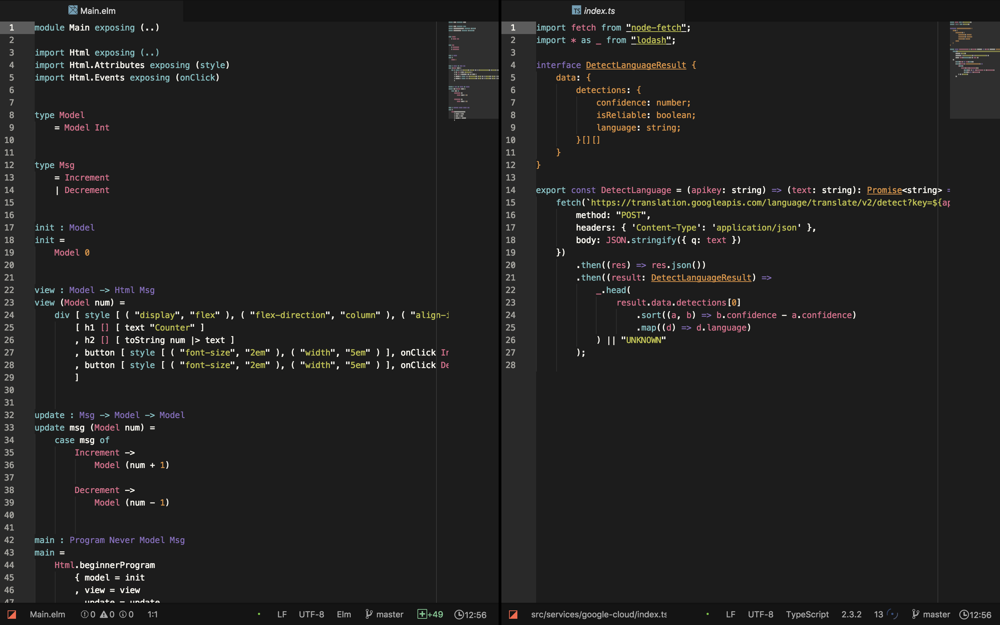

# japan-colors-syntax theme

An atom.io color theme based on
[The Traditional Colors of Japan](http://nipponcolors.com)



The colors included

```less
@kohbai              : #E16B8C; // 紅梅
@kuchiba             : #E2943B; // 朽葉
@hiwa                : #BEC23F; // 鶸
@aomidori            : #00AA90; // 青緑
@byakugun            : #78C2C4; // 白群
@fujimurasaki        : #8A6BBE; // 藤紫
@shironeri           : #FCFAF2; // 白練
@shironezumi         : #BDC0BA; // 白鼠
@ginnezumi           : #91989F; // 銀鼠
@nibi                : #656765; // 鈍
@keshizumi           : #434343; // 消炭
@sumi                : #1C1C1C; // 墨
```